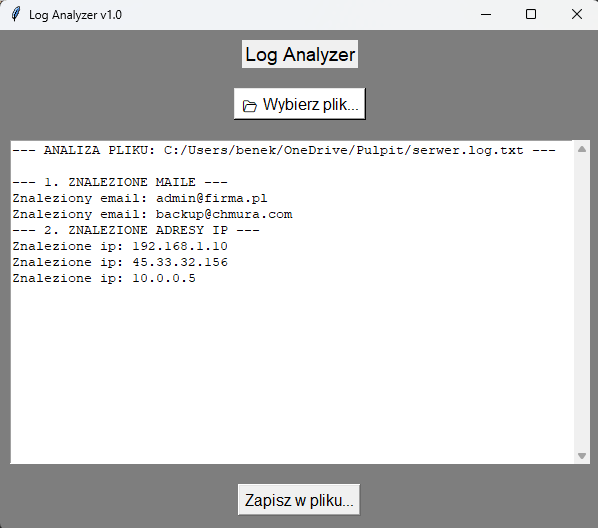

# 📂 Log Analyzer v1.0



Aplikacja desktopowa z graficznym interfejsem użytkownika (GUI), służąca do automatycznej analizy plików tekstowych i logów systemowych.

Program pozwala na szybkie "przeskanowanie" wybranego pliku i wyciągnięcie z niego kluczowych informacji, takich jak adresy e-mail oraz adresy IP, a następnie zapisanie raportu.

## 🚀 Funkcjonalności

* **Graficzny Interfejs (GUI):** Prosta i czytelna obsługa dzięki bibliotece `tkinter`.
* **Wczytywanie plików:** Obsługa okna dialogowego do wyboru plików z dysku.
* **Analiza danych (Regex):**
    * Wykrywanie adresów e-mail (wzorzec: `nazwa@domena`).
    * Wykrywanie adresów IP (IPv4).
* **Podgląd wyników:** Wyświetlanie znalezionych danych w przewijanym oknie tekstowym.
* **Eksport danych:** Możliwość zapisu wyników analizy do nowego pliku `.txt`.
* **Obsługa błędów:** Zabezpieczenie przed błędami kodowania znaków lub brakiem pliku.

## 🛠 Technologie

Projekt został napisany w języku **Python 3** przy użyciu bibliotek standardowych (nie wymaga instalacji zewnętrznych pakietów):
* `tkinter` - do budowy interfejsu graficznego.
* `re` (Regular Expressions) - do wyszukiwania wzorców w tekście.
* `os` / IO - do operacji na plikach.

## 💻 Jak uruchomić

1.  Upewnij się, że masz zainstalowanego Pythona.
2.  Sklonuj to repozytorium:
    ```bash
    git clone [https://github.com/beniaminsiarkowski/Log-analyzer.git](https://github.com/TWÓJ_NICK/Log-analyzer.git)
    ```
3.  Wejdź do folderu projektu i uruchom plik:
    ```bash
    python main.py
    ```
    *(Upewnij się, że plik z kodem nazywa się `main.py` lub wpisz właściwą nazwę)*.

Autor: Beniamin